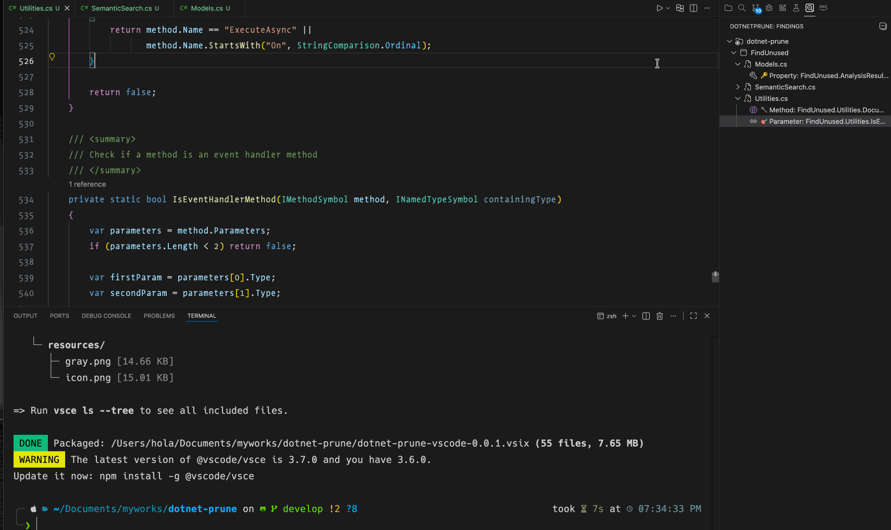

# DotNet Prune

DotNetPrune analyzes candidate unused code (methods, parameters, fields, properties, types) in .NET solutions using Roslyn and displays the results in VS Code through an integrated hierarchical tree view.

## Installation

Install the extension from the [VS Code Marketplace](https://marketplace.visualstudio.com/items?itemName=nomad-in-code.dotnet-prune-vscode).

## Features

- **Hierarchical Tree View**: Displays findings organized by Solution → Project → File → Unused Items
- **Smart File Filtering**: Only processes .NET-related files (.cs, .sln, .slnx, .csproj)
- **Direct Analysis Integration**: Runs the FindUnused analyzer directly from VS Code
- **Interactive Navigation**: Click on findings to open source files and highlight relevant lines
- **Solution-Aware Organization**: Automatically discovers and organizes findings by solution structure
- **Copy File Path**: Right-click context menu on file nodes to copy file paths to clipboard

## How It Works

1. **Automatic Solution Discovery**: The extension finds all .sln and .slnx files in your workspace
2. **Integrated Analysis**: Runs the bundled FindUnused analyzer tool directly
3. **Hierarchical Display**: Organizes findings in a logical tree structure:
   ```
   📁 MySolution.sln
     📁 MyProject
       📁 Program.cs (right-click to copy path)
         ⚠️ unused method: CalculateSum
         ⚠️ unused field: _cachedData
       📁 Utils.cs (right-click to copy path)
         ⚠️ unused class: HelperClass
   ```
4. **File Navigation**: Direct navigation to unused code locations

## Usage

### Running Analysis

1. Open a .NET workspace with solutions or projects
2. Use the **DotNetPrune: Run Analysis** command from the command palette
3. Select a solution or project file when prompted
4. View results in the DotNetPrune Activity Bar panel

### Tree View Navigation

- **Level 1**: Solutions (.sln/.slnx files)
- **Level 2**: Projects within each solution
- **Level 3**: Source files (.cs) within each project - right-click to copy file path
- **Level 4**: Individual unused code findings

### Commands

- **DotNetPrune: Refresh Findings**: Re-run analysis to refresh the tree view
- **DotNetPrune: Run Analysis**: Execute the FindUnused analyzer
- **DotNetPrune: Clear Findings**: Clear all displayed findings
- **DotNetPrune: Open Finding**: Navigate to the finding location in source code
- **Copy File Path**: Right-click on file nodes in the tree view to copy file paths to clipboard

## Extension Treeviewer

Extension analyses the solution and produces a JSON array of findings. Each finding includes:

- **Project** (string): Project name containing the unused code
- **FilePath** (string): Absolute path to the source file
- **Line** (number): 1-based line number of the finding
- **SymbolKind** (string): Type of code element ("Method", "Parameter", "Type", etc.)
- **ContainingType** (string): Class or type containing the unused element
- **SymbolName** (string): Name of the unused element
- **Accessibility** (string): Access modifier ("public", "private", etc.)
- **Remarks** (string): Additional information about the finding

## Technical Details

- **File Type Filtering**: Only processes .NET file types (.cs, .sln, .slnx, .csproj)
- **Solution Association**: Automatically associates projects with their parent solutions
- **Direct Integration**: Uses bundled FindUnused.dll tool for analysis
- **Real-time Processing**: Processes analyzer output directly without intermediate files

## Extension Usage



## Benefits

- **Clean Codebase Visualization**: Easily identify and remove unused code
- **Solution-Level Overview**: Understand unused code distribution across entire solutions
- **Efficient Navigation**: Quick access to unused code locations
- **Integrated Workflow**: No need to run external tools or manage report files
- **Smart Organization**: Findings are organized exactly as they appear in your solution structure

## Development

### Building the Extension

```bash
npm install
npm run compile
npm run package
```

### Running the Analyzer Directly

```bash
dotnet run --project FindUnused/FindUnused.csproj -- /path/to/YourSolution.sln
```
## Next Steps
- Update the analyzer to handle different dotnet project types.
- Optimize the analyzer for large solutions.
