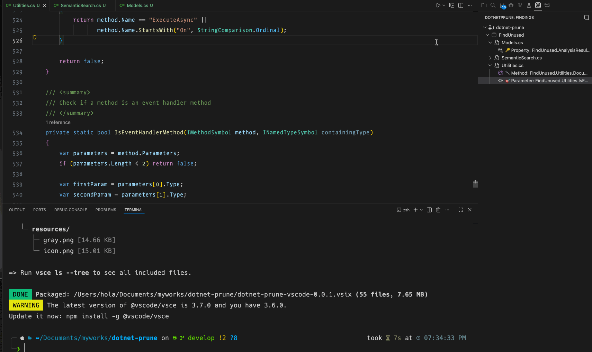

# DotNet Prune

DotNetPrune analyzes candidate unused code (methods, parameters, fields, properties, types) in .NET solutions using Roslyn and displays the results in VS Code through an integrated hierarchical tree view with advanced filtering, diagnostics, and actionable Quick Fixes.

---


## Features

### 🔍 Comprehensive Analysis
- **Hierarchical Tree View**: Displays findings organized by Solution → Project → File → Unused Items
- **Smart Detection**: Analyzes methods, properties, fields, parameters, and types
- **Confidence Levels**: Each finding includes a confidence score (0-100%) to help prioritize cleanup
- **Severity Indicators**: Findings categorized as errors, warnings, information, or hints

### 🎯 Advanced Filtering & Search
- **Filter by Symbol Kind**: Show only methods, properties, fields, parameters, or types
- **Filter by Confidence**: Focus on high-confidence findings to reduce false positives
- **Filter by Project**: Narrow results to specific projects
- **Full-Text Search**: Search across symbol names, types, files, and remarks
- **Clear All Filters**: Quickly reset to see all findings

### ✨ VS Code Integration
- **Problems Panel**: Findings appear as diagnostics in the Problems panel
- **Inline Highlighting**: Unused code is highlighted directly in the editor
- **Rich Tooltips**: Hover over highlighted code for detailed information
- **Quick Fixes**: Right-click or use Ctrl+. to delete or ignore unused code
- **Code Actions**: Access actions via the lightbulb menu

### 📊 Export & Reporting
- **Multiple Formats**: Export to JSON, CSV, Markdown, or HTML
- **Professional Reports**: HTML exports include styling, badges, and statistics
- **Team Collaboration**: Share reports for code review discussions
- **Automation Ready**: JSON format perfect for CI/CD integration

### ⚙️ Customization
- **Analysis Modes**: Choose between "strict" (fewer false positives) or "loose" (comprehensive)
- **Configurable Patterns**: Exclude/include specific files or directories
- **Symbol Filtering**: Select which symbol kinds to analyze
- **UI Options**: Toggle inline highlighting, confidence display, severity display
- **Performance Settings**: Enable caching and parallel analysis

### 🚀 User Experience
- **Ignore Findings**: Mark intentional unused code to hide from future analyses
- **Delete Unused Code**: Remove unused code with a single click (with confirmation)
- **Detailed Views**: View comprehensive finding details in a separate panel
- **Context Menus**: Right-click actions for files and projects
- **Interactive Navigation**: Click findings to jump to source code locations

## How It Works

1. **Automatic Solution Discovery**: The extension finds all .sln and .slnx files in your workspace
2. **Integrated Analysis**: Runs the bundled FindUnused analyzer tool directly
3. **Confidence Calculation**: Each finding is scored based on accessibility, symbol type, and usage patterns
4. **Hierarchical Display**: Organizes findings in a logical tree structure:
   ```
   📁 MySolution.sln
     📁 MyProject (85% confidence avg.)
       📁 Program.cs (right-click to copy path)
         ⚙️ unused method: CalculateSum (confidence: 90%)
         📦 unused field: _cachedData (confidence: 95%)
       📁 Utils.cs (right-click to copy path)
         🔷 unused class: HelperClass (confidence: 70%)
   ```
5. **Actionable Insights**: Delete, ignore, or investigate each finding

## Usage

### Running Analysis

1. Open a .NET workspace with solutions or projects
2. Use the **DotNetPrune: Run Analysis** command from the command palette
3. Select a solution or project file when prompted
4. View results in the DotNetPrune Activity Bar panel

### Filtering Results

- **By Symbol Kind**: Click the filter icon, select symbol kinds (Method, Property, etc.)
- **By Confidence**: Set minimum confidence threshold (e.g., 80% for high confidence)
- **By Project**: Select specific projects to view
- **By Search**: Enter text to find specific symbols

### Managing Findings

- **Ignore**: Right-click a finding → "Ignore This Finding"
- **Delete**: Right-click a finding → "Delete Unused Code"
- **Quick Fix**: Hover over highlighted code → Click lightbulb → Choose action
- **Details**: Right-click a finding → "Show Details"

### Exporting Reports

1. Click the export icon in the DotNetPrune panel toolbar
2. Choose format: JSON, CSV, Markdown, or HTML
3. Select save location
4. Open and review the report

### Tree View Navigation

- **Level 1**: Solutions (.sln/.slnx files)
- **Level 2**: Projects within each solution
- **Level 3**: Source files (.cs) within each project - right-click to copy file path
- **Level 4**: Individual unused code findings with confidence and severity

### Commands

- **DotNetPrune: Run Analysis**: Execute the FindUnused analyzer
- **DotNetPrune: Refresh Findings**: Re-run analysis to refresh the tree view
- **DotNetPrune: Clear Findings**: Clear all displayed findings
- **DotNetPrune: Filter by Symbol Kind**: Filter findings by symbol type
- **DotNetPrune: Filter by Confidence**: Filter by confidence level
- **DotNetPrune: Filter by Project**: Filter by project name
- **DotNetPrune: Search Findings**: Search across all findings
- **DotNetPrune: Clear All Filters**: Remove all active filters
- **DotNetPrune: Export Findings**: Export findings to file
- **DotNetPrune: Open Finding**: Navigate to the finding location in source code
- **Copy File Path**: Right-click on file nodes in the tree view to copy file paths to clipboard

## Extension Output

The extension analyzes solutions and produces findings with rich metadata. Each finding includes:

- **Project** (string): Project name containing the unused code
- **FilePath** (string): Absolute path to the source file
- **Line** (number): 1-based line number of the finding
- **SymbolKind** (string): Type of code element ("Method", "Parameter", "Type", etc.)
- **ContainingType** (string): Class or type containing the unused element
- **SymbolName** (string): Name of the unused element
- **Accessibility** (string): Access modifier ("public", "private", etc.)
- **Confidence** (number): 0-100 score indicating likelihood this is truly unused
- **Severity** (string): "error", "warning", "information", or "hint"
- **Remarks** (string): Additional information about the finding

## Configuration

Access settings via File > Preferences > Settings, then search for "DotNetPrune":

### Analysis
- `dotnetprune.analysis.includePublicSymbols`: Include public symbols (default: true)
- `dotnetprune.analysis.includeInternalSymbols`: Include internal symbols (default: true)
- `dotnetprune.analysis.excludeGeneratedCode`: Exclude generated code (default: true)
- `dotnetprune.analysis.mode`: "strict" or "loose" (default: "loose")
- `dotnetprune.analysis.detectDeadCode`: Detect unreachable code (default: false, experimental)
- `dotnetprune.analysis.detectTodoComments`: Detect TODO/HACK comments (default: false)

### Filtering
- `dotnetprune.filter.exclusionPatterns`: Patterns to exclude (default: `**/bin/**`, `**/obj/**`)
- `dotnetprune.filter.inclusionPatterns`: Patterns to include (default: `**/*.cs`, etc.)
- `dotnetprune.filter.symbolKinds`: Symbol kinds to analyze

### UI
- `dotnetprune.ui.enableInlineHighlighting`: Highlight unused code in editor (default: true)
- `dotnetprune.ui.showConfidence`: Show confidence levels (default: true)
- `dotnetprune.ui.showSeverity`: Show severity levels (default: true)

### Integration
- `dotnetprune.integration.enableProblemsPanel`: Show in Problems panel (default: true)
- `dotnetprune.integration.enableCodeActions`: Enable Quick Fixes (default: true)

### Performance
- `dotnetprune.performance.enableCaching`: Cache results (default: true)
- `dotnetprune.performance.parallelAnalysis`: Parallel project analysis (default: true)

## Technical Details

- **File Type Filtering**: Only processes .NET file types (.cs, .sln, .slnx, .csproj)
- **Solution Association**: Automatically associates projects with their parent solutions
- **Direct Integration**: Uses bundled FindUnused.dll tool for analysis
- **Real-time Processing**: Processes analyzer output directly without intermediate files
- **Roslyn-Based**: Leverages Microsoft.CodeAnalysis for accurate symbol analysis
- **Parallel Analysis**: Projects analyzed in parallel for improved performance

## Extension Usage



## Benefits

- **Clean Codebase Visualization**: Easily identify and remove unused code
- **Solution-Level Overview**: Understand unused code distribution across entire solutions
- **Efficient Navigation**: Quick access to unused code locations
- **Integrated Workflow**: No need to run external tools or manage report files
- **Smart Organization**: Findings organized exactly as they appear in your solution structure
- **Data-Driven Decisions**: Confidence levels help prioritize cleanup efforts
- **Team Collaboration**: Export and share findings for code review
- **Quality Metrics**: Track code quality improvements over time

## Documentation

- **[User Guide](docs/USER_GUIDE.md)**: Comprehensive guide for using the extension
- **[Developer Guide](docs/DEVELOPER_GUIDE.md)**: Architecture and development information
- **[Changelog](CHANGELOG.md)**: Version history and release notes

## Development

### Building the Extension

```bash
npm install
npm run compile
npm run package
```

### Running the Analyzer Directly

```bash
dotnet run --project FindUnused/FindUnused.csproj -- /path/to/YourSolution.sln
```

### Contributing

Contributions are welcome! Please read the [Developer Guide](docs/DEVELOPER_GUIDE.md) and [Contributing Guide](CONTRIBUTING.md) for details.

## Support

- **Issues**: [GitHub Issues](https://github.com/chaluvadis/dotnet-prune/issues)
- **Discussions**: [GitHub Discussions](https://github.com/chaluvadis/dotnet-prune/discussions)

## License

MIT License - see [LICENSE](LICENSE) file for details

## Acknowledgments

Built with:
- [Microsoft Roslyn](https://github.com/dotnet/roslyn) for C# code analysis
- [VS Code Extension API](https://code.visualstudio.com/api) for editor integration
